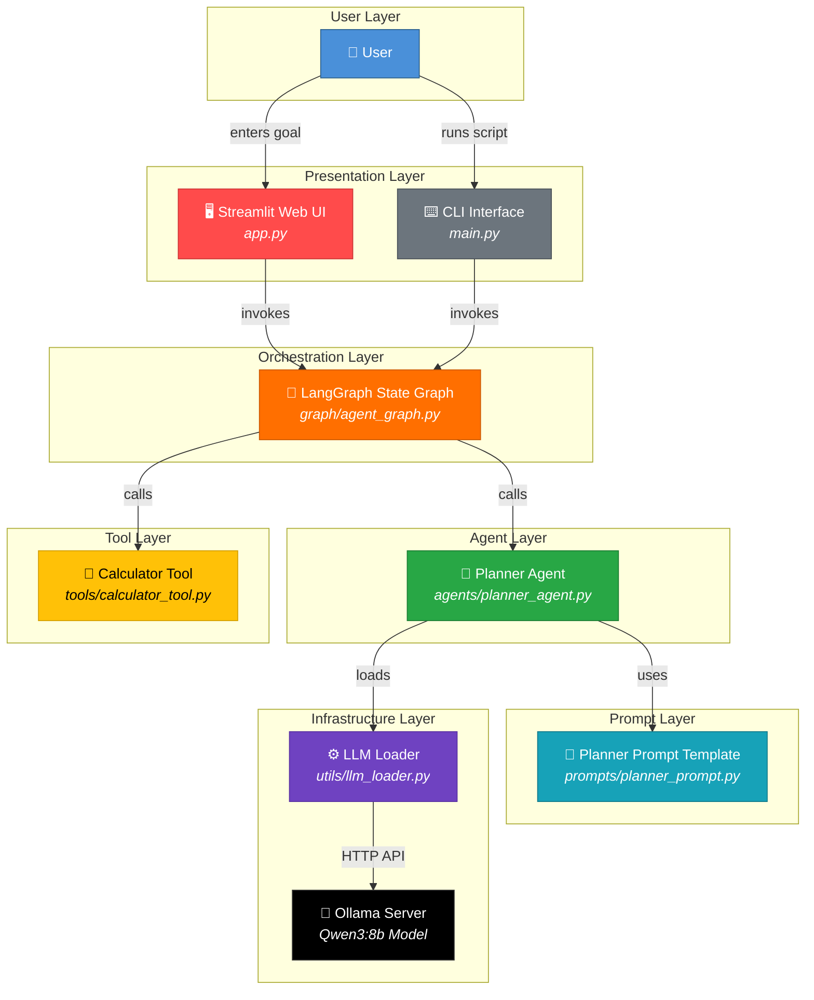
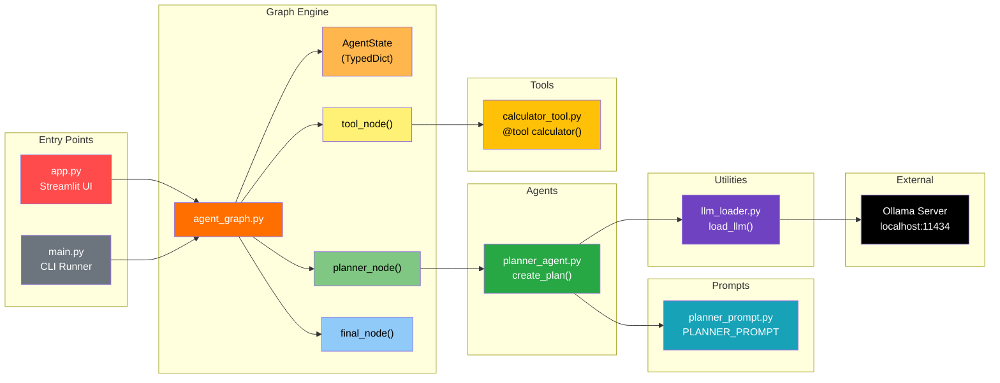
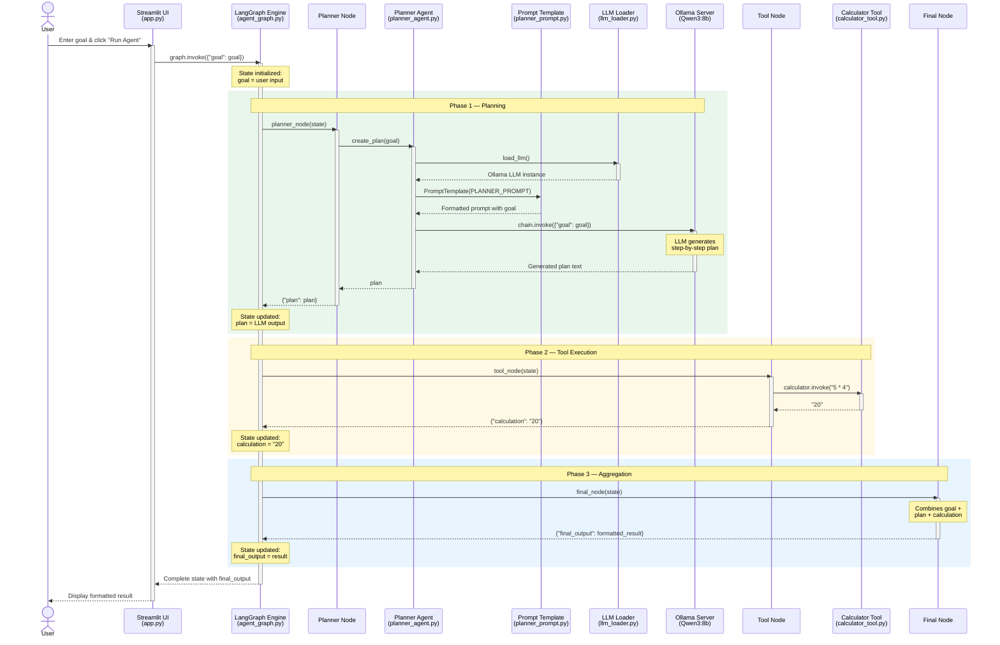
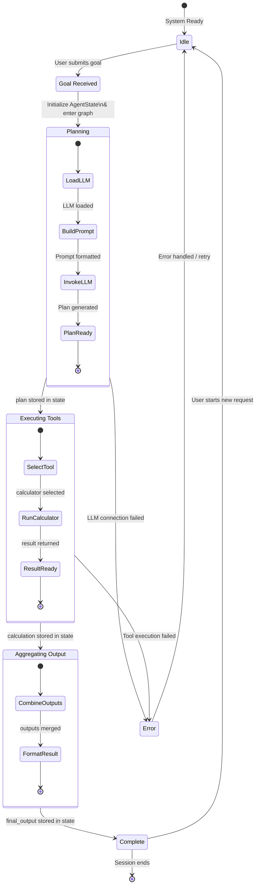
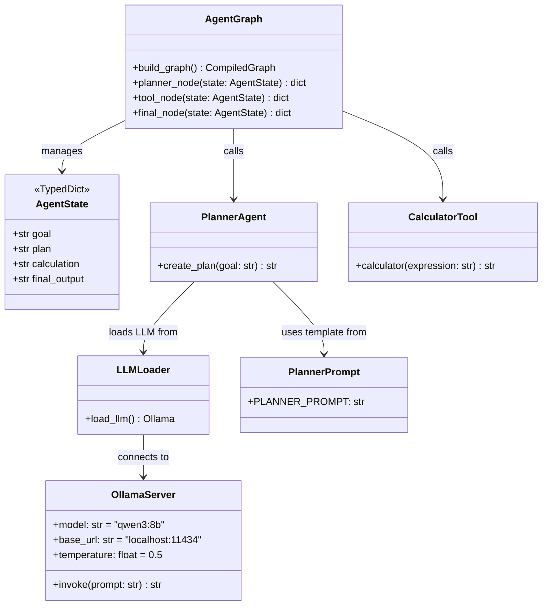
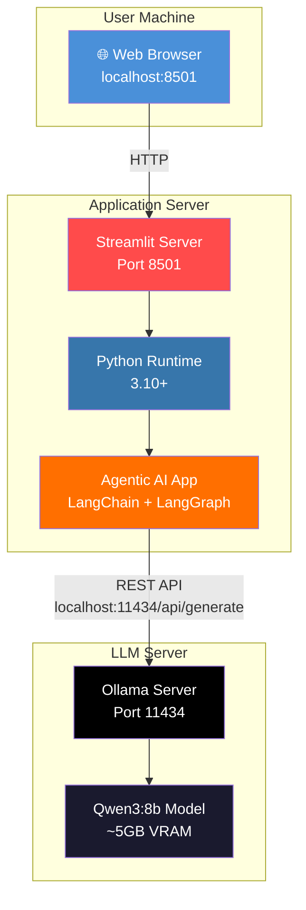

<div align="center">

# 🏗️ System Design & Architecture

### Agentic AI Demo — Technical Architecture Document

</div>

---

## 📑 Table of Contents

- [1. System Overview](#1-system-overview)
- [2. High-Level Architecture](#2-high-level-architecture)
- [3. Component Architecture](#3-component-architecture)
- [4. Data Flow — Sequence Diagram](#4-data-flow--sequence-diagram)
- [5. State Machine — Automata Diagram](#5-state-machine--automata-diagram)
- [6. Module Breakdown](#6-module-breakdown)
- [7. Class & Type Diagram](#7-class--type-diagram)
- [8. Deployment Architecture](#8-deployment-architecture)
- [9. Design Decisions](#9-design-decisions)

---

## 1. System Overview

The **Agentic AI Demo** is a goal-driven autonomous agent system that follows a **plan → execute → aggregate** paradigm. A user provides a high-level goal, and the system:

1. **Plans** — Decomposes the goal into actionable sub-tasks using an LLM.
2. **Executes** — Runs tool-augmented actions (e.g., calculations) on the planned steps.
3. **Aggregates** — Combines the plan and tool outputs into a final structured result.

The entire pipeline is orchestrated as a **directed acyclic graph (DAG)** using LangGraph, with each processing stage represented as a node in the graph.

---

## 2. High-Level Architecture



---

## 3. Component Architecture



---

## 4. Data Flow — Sequence Diagram

This sequence diagram shows the complete lifecycle of a user request flowing through all system components.



---

## 5. State Machine — Automata Diagram

The following **finite state automaton (FSA)** represents the agent's state transitions during execution. Each state corresponds to a node in the LangGraph workflow, and transitions are deterministic.



### State Transition Table

| Current State      | Event / Trigger                | Next State          | Action                                      |
| ------------------- | ------------------------------ | ------------------- | ------------------------------------------- |
| **Idle**            | User submits goal              | Goal Received       | Capture user input                          |
| **Goal Received**   | Graph invoked                  | Planning            | Initialize `AgentState`, enter graph        |
| **Planning**        | LLM loaded, prompt built       | Planning (internal) | Load Ollama, format prompt, invoke LLM      |
| **Planning**        | Plan generated                 | Executing Tools     | Store plan in state, transition to next node|
| **Planning**        | LLM connection failed          | Error               | Log error, return failure message            |
| **Executing Tools** | Tool selected & executed       | Aggregating Output  | Run calculator, store result in state        |
| **Executing Tools** | Tool execution failed          | Error               | Log error, return failure message            |
| **Aggregating**     | Outputs combined & formatted   | Complete            | Build final output string                    |
| **Complete**        | New goal submitted             | Idle                | Reset state for next invocation              |
| **Error**           | Retry / error handled          | Idle                | Return to ready state                        |

---

## 6. Module Breakdown

### `AgentState` — The Shared State Object

The entire graph communicates through a single typed state dictionary:

```python
class AgentState(TypedDict):
    goal: str           # User's high-level goal (input)
    plan: str           # Generated step-by-step plan (planner output)
    calculation: str    # Tool execution result (tool output)
    final_output: str   # Aggregated final response (final output)
```

### Data mutation through the graph:

```
┌─────────────┬───────────────────┬───────────────────┬───────────────────┐
│   Field     │  After Planner    │  After Tool       │  After Final      │
├─────────────┼───────────────────┼───────────────────┼───────────────────┤
│ goal        │ ✅ "prepare ML.." │ ✅ "prepare ML.." │ ✅ "prepare ML.." │
│ plan        │ ✅ "Step 1:..."   │ ✅ "Step 1:..."   │ ✅ "Step 1:..."   │
│ calculation │ ❌ (empty)        │ ✅ "20"           │ ✅ "20"           │
│ final_output│ ❌ (empty)        │ ❌ (empty)        │ ✅ formatted str  │
└─────────────┴───────────────────┴───────────────────┴───────────────────┘
```

### Graph Construction

```python
workflow = StateGraph(AgentState)

workflow.add_node("planner", planner_node)   # Node 1
workflow.add_node("tool", tool_node)         # Node 2
workflow.add_node("final", final_node)       # Node 3

workflow.set_entry_point("planner")          # Start here

workflow.add_edge("planner", "tool")         # planner → tool
workflow.add_edge("tool", "final")           # tool → final
workflow.add_edge("final", END)              # final → END
```

---

## 7. Class & Type Diagram



---

## 8. Deployment Architecture



| Component         | Port   | Protocol | Notes                           |
| ----------------- | ------ | -------- | ------------------------------- |
| Streamlit UI      | `8501` | HTTP     | User-facing web interface       |
| Ollama API        | `11434`| HTTP     | LLM inference endpoint          |

---

## 9. Design Decisions

| Decision                         | Rationale                                                                                      |
| -------------------------------- | ---------------------------------------------------------------------------------------------- |
| **LangGraph over simple chains** | Enables stateful, graph-based orchestration with clear node boundaries and future branching     |
| **Ollama for local LLM**         | Zero-cost, fully private inference with no API keys or cloud dependency                        |
| **Qwen3:8b model**               | Strong instruction-following at a reasonable hardware footprint (~5 GB VRAM)                   |
| **Streamlit for UI**             | Rapid prototyping with minimal frontend code; ideal for AI/ML demos                            |
| **TypedDict for state**          | Type-safe state management with clear schema; compatible with LangGraph's state system         |
| **Modular folder structure**     | Agents, tools, prompts, and utilities are decoupled for independent development and testing     |
| **Deterministic edges**          | Linear `planner → tool → final` flow keeps the system predictable and debuggable               |

---

<div align="center">

*This document is part of the [Agentic AI Demo](README.md) project.*

</div>
