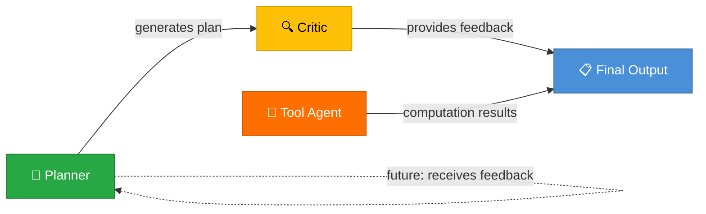
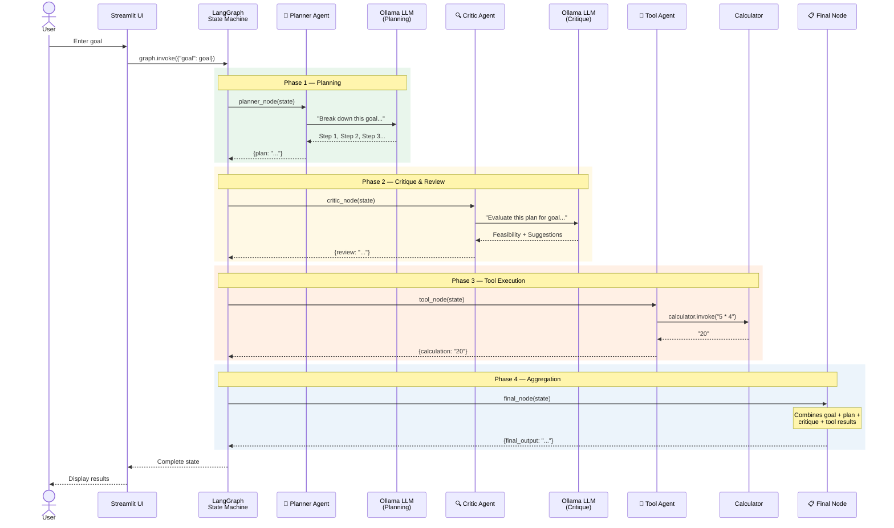

<div align="center">

# 🤖🤝🧠 Multi-Agent AI Planner

### Collaborative Multi-Agent System with Planning & Critique — Powered by Local LLMs

[](https://www.python.org/)
[](https://www.langchain.com/)
[](https://langchain-ai.github.io/langgraph/)
[](https://ollama.com/)
[](https://streamlit.io/)
[](LICENSE)
[]()

---

**Multi-Agent AI Planner** is an autonomous multi-agent system where specialized AI agents **collaborate** to produce high-quality, critique-refined plans. A *Planner Agent* generates step-by-step strategies, a *Critic Agent* evaluates feasibility and suggests improvements, and a *Tool Agent* executes auxiliary computations — all orchestrated through a LangGraph state graph.

*Fully local. No API keys. Private & extensible.*

</div>

---

## 📑 Table of Contents

- [Problem Statement](#-problem-statement)
- [Features](#-features)
- [Multi-Agent Architecture](#-multi-agent-architecture)
- [Agent Roles & Responsibilities](#-agent-roles--responsibilities)
- [Data Flow — Sequence Diagram](#-data-flow--sequence-diagram)
- [Demo / Screenshots](#-demo--screenshots)
- [Tech Stack](#-tech-stack)
- [Project Structure](#-project-structure)
- [Installation & Setup](#-installation--setup)
- [Usage](#-usage)
- [API Documentation](#-api-documentation)
- [Testing](#-testing)
- [Deployment](#-deployment)
- [Contributing](#-contributing)
- [Roadmap / Future Improvements](#-roadmap--future-improvements)
- [License](#-license)
- [Contact / Author](#-contact--author)

---

## 🎯 Problem Statement

Single-agent AI systems generate plans without self-reflection, often producing outputs that are:

- ❌ **Overly optimistic** — ignoring real-world constraints
- ❌ **Unverified** — no feasibility check before delivery
- ❌ **Rigid** — no iterative refinement loop

**Multi-Agent AI Planner** solves this by introducing a **Critic Agent** that reviews and challenges the Planner's output, creating a **feedback loop** that mimics real-world team collaboration between a strategist and a reviewer.

---

## ✨ Features

- **🧠 Planner Agent** — Decomposes high-level goals into logical, executable sub-tasks
- **🔍 Critic Agent** — Reviews generated plans for feasibility and provides improvement suggestions
- **🧮 Tool Execution** — Integrates tools (calculator, etc.) that agents can invoke during the workflow
- **🔗 Graph-Based Orchestration** — LangGraph state machine drives multi-agent coordination with typed state
- **💻 100% Local Inference** — Runs on Ollama with Qwen3:8b — zero cloud, zero cost, full privacy
- **🖥️ Interactive Web UI** — Streamlit-based interface for goal input and result visualization
- **📦 Modular Design** — Each agent, tool, and prompt is an independent, swappable module
- **🔄 Extensible Pipeline** — Add new agents, tools, or graph nodes without modifying existing logic

---

## 🏗️ Multi-Agent Architecture

```
                          ┌────────────────────────────────────────┐
                          │            👤  USER                    │
                          │     Enters a high-level goal           │
                          └──────────────┬─────────────────────────┘
                                         │
                          ┌──────────────▼─────────────────────────┐
                          │         🖥️  STREAMLIT UI               │
                          │     Captures goal, displays results    │
                          └──────────────┬─────────────────────────┘
                                         │
                          ┌──────────────▼─────────────────────────┐
                          │      🔗  LANGGRAPH STATE MACHINE       │
                          │     Orchestrates agent execution       │
                          └──────────────┬─────────────────────────┘
                                         │
              ┌──────────────────────────┼──────────────────────────┐
              │                          │                          │
    ┌─────────▼──────────┐   ┌───────────▼──────────┐   ┌──────────▼─────────┐
    │  🧠 PLANNER AGENT  │   │  🔍 CRITIC AGENT     │   │  🧮 TOOL AGENT     │
    │                    │   │                      │   │                    │
    │  • Decomposes goal │   │  • Reviews plan      │   │  • Executes tools  │
    │  • Creates steps   │   │  • Checks feasibility│   │  • Calculator etc. │
    │  • Uses LLM        │   │  • Suggests fixes    │   │  • Returns results │
    └────────────────────┘   └──────────────────────┘   └────────────────────┘
              │                          │                          │
              └──────────────────────────┼──────────────────────────┘
                                         │
                          ┌──────────────▼─────────────────────────┐
                          │       📋  FINAL AGGREGATION NODE       │
                          │  Combines plan + critique + tool output │
                          └────────────────────────────────────────┘
```

---

## 🤖 Agent Roles & Responsibilities

| Agent | Role | Input | Output | Prompt Strategy |
|-------|------|-------|--------|-----------------|
| **🧠 Planner Agent** | Strategist | User's goal | Step-by-step plan | Decompose goal into clear, executable steps without solving |
| **🔍 Critic Agent** | Reviewer | Goal + Plan | Feasibility assessment & improvement suggestions | Evaluate plan realism, time constraints, and completeness |
| **🧮 Tool Agent** | Executor | Tool expressions | Computed results | Execute mathematical or utility operations |

### Agent Interaction Pattern



---

## 📊 Data Flow — Sequence Diagram



---

## 📸 Demo / Screenshots

> **🚧 Coming Soon** — Screenshots and a live demo link will be added here.
>
> To preview locally, follow the [Installation & Setup](#-installation--setup) guide below.

<!-- Add screenshots here:

-->

---

## 🛠️ Tech Stack

| Layer | Technology | Purpose |
|-------|-----------|---------|
| **LLM Runtime** | [Ollama](https://ollama.com/) + [Qwen3:8b](https://ollama.com/library/qwen3) | Local LLM inference for all agents |
| **Agent Framework** | [LangChain](https://www.langchain.com/) | Prompt management, chains, tool integration |
| **Orchestration** | [LangGraph](https://langchain-ai.github.io/langgraph/) | Stateful multi-agent graph execution |
| **Frontend** | [Streamlit](https://streamlit.io/) | Interactive web UI |
| **Language** | Python 3.10+ | Core runtime |
| **Env Management** | `venv` + `pip` | Dependency isolation |

---

## 📁 Project Structure

```
agentic-ai-demo/
│
├── agents/                         # 🤖 AI Agent Modules
│   ├── planner_agent.py            #    Planner — goal decomposition
│   └── critic_agent.py             #    Critic — plan review & suggestions
│
├── graph/                          # 🔗 Orchestration Layer
│   └── agent_graph.py              #    LangGraph state machine definition
│
├── prompts/                        # 📝 Prompt Templates
│   └── planner_prompt.py           #    Planner prompt template
│
├── tools/                          # 🧮 Tool Integrations
│   └── calculator_tool.py          #    Calculator tool (@tool decorated)
│
├── utils/                          # ⚙️ Shared Utilities
│   └── llm_loader.py              #    Ollama LLM loader (Qwen3:8b)
│
├── app.py                          # 🖥️ Streamlit web UI entry point
├── main.py                         # ⌨️ CLI entry point
├── test_llm.py                     # 🧪 Test — LLM connectivity
├── test_planner.py                 # 🧪 Test — planner agent
├── test_tool.py                    # 🧪 Test — calculator tool
├── requirements.txt                # 📦 Python dependencies
├── ARCHITECTURE.md                 # 🏗️ System design document
├── MULTI_AGENT_README.md           # 📘 This file
└── README.md                       # 📗 Main project README
```

---

## 🚀 Installation & Setup

### Prerequisites

| Requirement | Version | Notes |
|-------------|---------|-------|
| **Python** | ≥ 3.10 | Required |
| **Ollama** | Latest | [Install Guide](https://ollama.com/download) |
| **Git** | Latest | Repository cloning |
| **RAM** | ≥ 8 GB | For Qwen3:8b model inference |

### Step-by-Step Installation

```bash
# 1. Clone the repository
git clone https://github.com/AMAANALI70/agentic-ai-demo.git
cd agentic-ai-demo

# 2. Create and activate virtual environment
python3 -m venv venv
source venv/bin/activate          # Linux / macOS
# venv\Scripts\activate            # Windows

# 3. Install Python dependencies
pip install -r requirements.txt

# 4. Install Ollama and pull the model
curl -fsSL https://ollama.com/install.sh | sh
ollama pull qwen3:8b

# 5. Start the Ollama server
ollama serve
```

### Environment Variables *(Optional)*

```env
# .env (create in project root)
OLLAMA_BASE_URL=http://localhost:11434
OLLAMA_MODEL=qwen3:8b
```

---

## 💡 Usage

### Web UI *(Recommended)*

```bash
streamlit run app.py
```

1. Open `http://localhost:8501` in your browser
2. Enter a goal (e.g., *"Help me prepare for ML exam in 5 days"*)
3. Click **Run Agent**
4. View the plan, critique, and tool results

### Command Line

```bash
python main.py
```

**Example Output:**

```
AGENT OUTPUT:

Goal:
Help me prepare for ML exam in 5 days

Plan:
Step 1: Review core ML concepts (supervised, unsupervised, reinforcement learning)
Step 2: Practice key algorithms — linear regression, decision trees, SVM, KNN
Step 3: Work through hands-on projects and Kaggle datasets
Step 4: Take timed practice tests
Step 5: Revise weak areas and review notes

Critic Review:
Feasibility: Mostly feasible but ambitious for 5 days
Suggestions:
- Prioritize Steps 1-2 in the first 2 days
- Reduce Kaggle scope to 1-2 small datasets
- Add a buffer day for review

Calculation Result:
20
```

---

## 📡 API Documentation

### Internal Agent APIs

#### `create_plan(goal: str) → str`
Generates a step-by-step plan for the given goal.

```python
from agents.planner_agent import create_plan

plan = create_plan("Learn Python in 7 days")
print(plan)
```

#### `review_plan(goal: str, plan: str) → str`
Evaluates a plan's feasibility and provides improvement suggestions.

```python
from agents.critic_agent import review_plan

review = review_plan(
    goal="Learn Python in 7 days",
    plan="Step 1: Install Python\nStep 2: Learn syntax..."
)
print(review)
```

#### `calculator.invoke(expression: str) → str`
Executes a mathematical expression.

```python
from tools.calculator_tool import calculator

result = calculator.invoke("365 / 7")
print(result)  # "52.142857..."
```

#### `build_graph() → CompiledGraph`
Builds and compiles the multi-agent LangGraph workflow.

```python
from graph.agent_graph import build_graph

graph = build_graph()
result = graph.invoke({"goal": "Your goal here"})
print(result["final_output"])
```

---

## 🧪 Testing

```bash
# Test LLM connectivity
python test_llm.py

# Test planner agent
python test_planner.py

# Test calculator tool
python test_tool.py
```

| Script | Tests | Expected Output |
|--------|-------|-----------------|
| `test_llm.py` | Ollama + Qwen3 connection | AI agent definition |
| `test_planner.py` | Goal → plan generation | Step-by-step plan |
| `test_tool.py` | Calculator invocation | `"50"` |

> ⚠️ **Ensure Ollama is running** (`ollama serve`) before executing tests.

---

## 🌐 Deployment

### Local (Default)

Follow the [Installation & Setup](#-installation--setup) section — the application is designed for local-first use.

### Cloud VM

```bash
# On a VM with ≥ 8 GB RAM (AWS EC2, GCP, Azure)
ollama pull qwen3:8b && ollama serve &
streamlit run app.py --server.port 8501 --server.address 0.0.0.0
```

Access at `http://<VM_PUBLIC_IP>:8501`

### Docker *(Planned)*

```yaml
# docker-compose.yml (coming soon)
services:
  app:
    build: .
    ports:
      - "8501:8501"
    depends_on:
      - ollama
  ollama:
    image: ollama/ollama
    ports:
      - "11434:11434"
```

---

## 🤝 Contributing

Contributions are welcome! Here's how:

1. **Fork** the repository
2. **Create** a feature branch: `git checkout -b feature/new-agent`
3. **Commit** with [Conventional Commits](https://www.conventionalcommits.org/): `git commit -m "feat: add research agent"`
4. **Push**: `git push origin feature/new-agent`
5. **Open a Pull Request** with a clear description

### How to Add a New Agent

```python
# 1. Create agents/your_agent.py
from langchain_core.prompts import PromptTemplate
from utils.llm_loader import load_llm

def your_agent_function(input_data):
    llm = load_llm()
    prompt = PromptTemplate(
        input_variables=["input"],
        template="Your prompt template: {input}"
    )
    chain = prompt | llm
    return chain.invoke({"input": input_data})

# 2. Add a node in graph/agent_graph.py
# 3. Wire edges in build_graph()
# 4. Add a test script: test_your_agent.py
```

---

## 🗺️ Roadmap / Future Improvements

- [ ] 🔄 **Feedback Loop** — Let the Planner revise its plan based on Critic feedback (iterative refinement)
- [ ] 🔍 **Web Search Agent** — Add an agent that retrieves real-time information from the internet
- [ ] 📄 **Summarizer Agent** — PDF / web page summarization agent
- [ ] 🧠 **Memory Layer** — Add conversation memory for multi-turn goal refinement
- [ ] 🎭 **Dynamic Agent Selection** — Router that selects which agents to invoke based on goal type
- [ ] 🔀 **Conditional Graph Routing** — Branch the graph based on Critic's assessment
- [ ] 📊 **Execution Trace Dashboard** — Visualize agent interactions and graph state in real-time
- [ ] 🐳 **Docker + Docker Compose** — Fully containerized deployment
- [ ] 🧪 **Pytest Suite** — Comprehensive automated tests with mocking
- [ ] 🌍 **Multi-Model Support** — Swap between Qwen, Llama, Mistral, etc. per agent

---

## 📄 License

This project is licensed under the **MIT License** — see the [LICENSE](LICENSE) file for details.

---

## 👤 Contact / Author

| Field | Details |
|-------|---------|
| **Author** | *Your Name* |
| **Email** | *your.email@example.com* |
| **GitHub** | [github.com/AMAANALI70](https://github.com/AMAANALI70) |
| **LinkedIn** | [linkedin.com/in/your-profile](https://linkedin.com/in/your-profile) |

---

<div align="center">

**⭐ Star this repo if multi-agent AI excites you! ⭐**

*Built with ❤️ using LangChain • LangGraph • Ollama • Streamlit*

</div>
